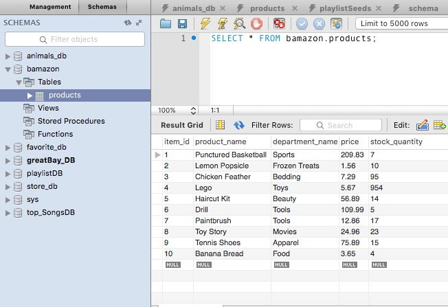
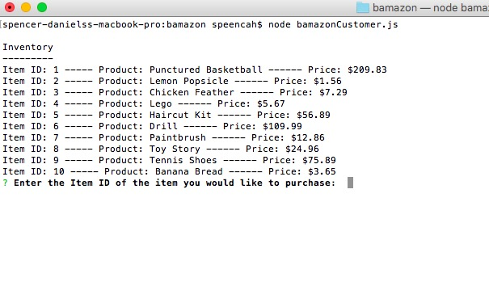
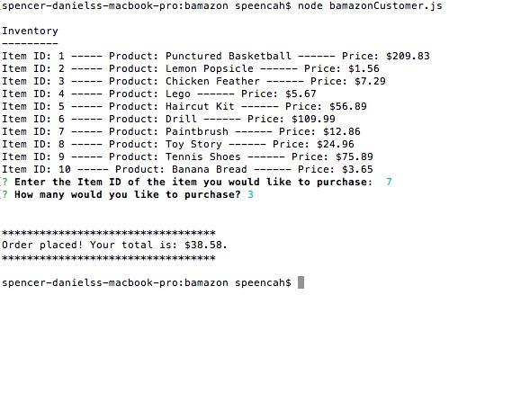
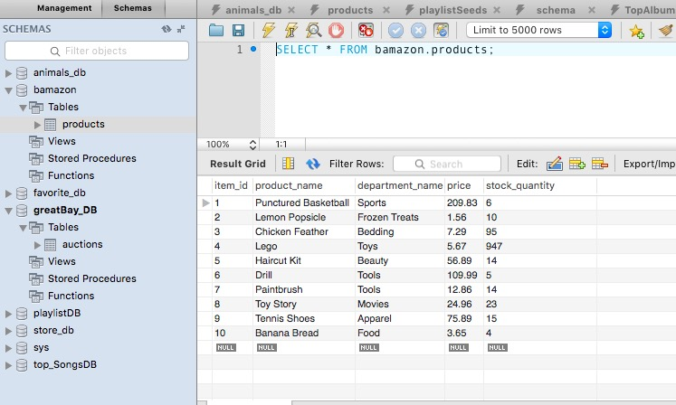
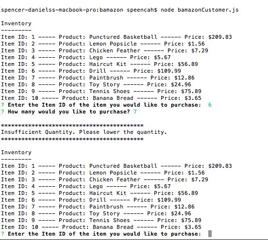

# bamazon

# Images in ReadMe

<h3>Database before running app. Notice Item 7, Paintbrush. The quantity in stock is 17</h3>

<h3>Showing inventory after starting app</h3>

<h3>Placing an order for quantity 3 of the Paintbrush</h3>

<h3>Database after placing order. Notice the the paintbrush quantity has decreased by 3 to 14.</h3>

<h3>This shows what happens if you try to order more than what's available in stock. I'm trying to order 7 drills, but there are only 5 in stock. The app shows the inventory again and allows the user to try the order again.</h3>

